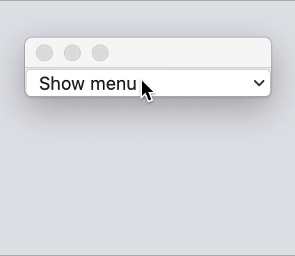

# 🐞 SwiftUI MenuButton Bug 🦟

| **Steps to reproduce**                                       | Result |
| ------------------------------------------------------------ | ---- |
| 1. Download this project and open in Xcode<br/>2. Run the macOS "MenuItems" target<br/>3. Click on "Show menu"<br/>4. Hover over the menu items ||


## Code

```swift
import SwiftUI

struct ContentView: View {
    var body: some View {
		MenuButton("Show menu") {
			Button("first") {}
			Button("second") {}
			Divider()
			Text("label")
			Button("third") {}
		}
    }
}
```

